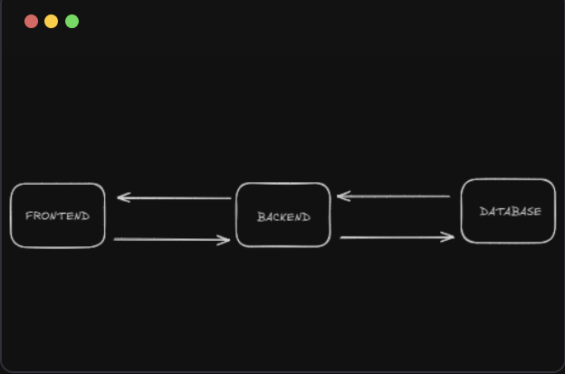

# Backend and Frontend Communication with Database



## Tutoring Session Form Backend

This project is a backend system for managing tutoring session requests. It uses Express.js as the server, PostgreSQL as the database, and handles form submissions through AJAX. The form allows parents to request a free tutoring session for their children.

## Features

- **Form Submission**: Parents can submit a request for a tutoring session by filling out a form with their and their child's details.
- **Database Storage**: The form data is stored in a PostgreSQL database for future reference.
- **Modal Popup**: The form is presented in a modal popup for a seamless user experience.
- **AJAX Request**: The form uses AJAX (via `fetch`) to submit data to the server without refreshing the page.
- **Validation**: Server-side validation ensures that all required fields are provided before submission.

## Prerequisites

Before running the project, make sure you have the following installed:

- [Node.js](https://nodejs.org/) (Version 14 or higher)
- [PostgreSQL](https://www.postgresql.org/download/) (Version 13 or higher)

### Database Configuration

Make sure you have a PostgreSQL database running with the following credentials:

- **Database**: `tutoring_sessions`
- **User**: `postgres`
- **Password**: `your_password_here`
- **Port**: `5432`

You can configure these in the `.env` file.

## Getting Started

### 1. Clone the Repository

```bash
git clone https://github.com/your-username/tutoring-session-form-backend.git
cd tutoring-session-form-backend
```

### 2. Install Dependencies

Install the necessary Node.js dependencies:

```bash
npm install
```

### 3. Set Up the `.env` File

Create a `.env` file in the root directory of your project with the following content:

```env
PORT=5000
NODE_ENV=development

# PostgreSQL Database Configuration
DB_USER=postgres
DB_HOST=localhost
DB_NAME=tutoring_sessions
DB_PASSWORD=your_password_here
DB_PORT=5432
```

Replace `your_password_here` with your actual PostgreSQL password.

### 4. Initialize the Database

Run the `init.js` script to initialize the PostgreSQL database and create the necessary table:

```bash
node tutoring_seesion_form_backend_db/init.js
```

This will create the `session_requests` table if it does not exist already.

### 5. Run the Server

Start the server using the following command:

```bash
node server.js
```

Your server will now be running on `http://localhost:5000`.

### 6. Frontend Setup

Ensure your HTML form is correctly linked to the `script.js` file and included in the HTML structure. You can open the `index.html` file in your browser to test the form.

---

## Usage

1. **Submit a Session Request**:
  
   - Go to the homepage and click the "Get Free Session Now" button.
   - A modal will pop up with a form asking for the parent's name, email, child's grade, and child's name.
   - Submit the form and the data will be saved to the database.

2. **Database**:
   - All form submissions are stored in the PostgreSQL database under the `session_requests` table.
   - You can view the stored requests using SQL queries or a PostgreSQL database management tool like pgAdmin.

---

## API Endpoints

- **POST `/submit-session`**: Handles form submissions.
  - **Request Body**:
  
    ```json
  
    {
      "parentFirstName": "John",
      "parentLastName": "Doe",
      "parentEmail": "johndoe@example.com",
      "grade": "Grade 1",
      "childName": "Jane Doe"
    }
    ```
  
  - **Response**:
  
    ```json
    {
      "message": "Session request submitted successfully",
      "data": {
        "id": 1,
        "parent_first_name": "John",
        "parent_last_name": "Doe",
        "parent_email": "johndoe@example.com",
        "child_grade": "Grade 1",
        "child_name": "Jane Doe",
        "created_at": "2025-04-20T12:34:56Z"
      }
    }
    ```

---

## Testing

For testing, you can use tools like [Postman](https://www.postman.com/) to make POST requests to `http://localhost:5000/submit-session` with form data.

---

## License

This project is licensed under the MIT License - see the [LICENSE](LICENSE) file for details.

---

## Contributing

Feel free to fork this repository and make improvements. If you'd like to contribute, please fork the repo, create a feature branch, and submit a pull request.

---

## Acknowledgments

- [Express.js](https://expressjs.com/)
- [PostgreSQL](https://www.postgresql.org/)
- [Node.js](https://nodejs.org/)
